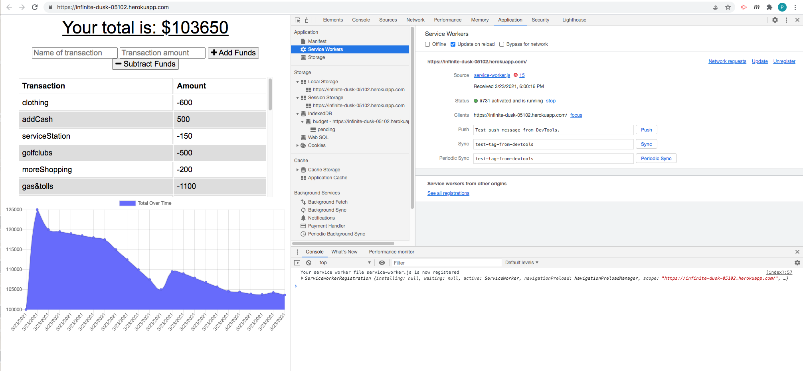
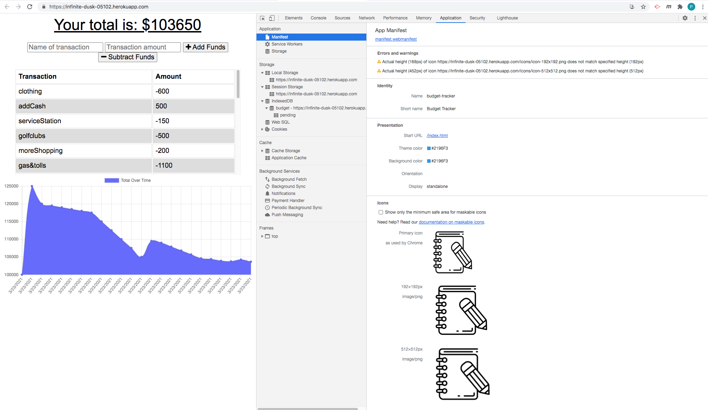
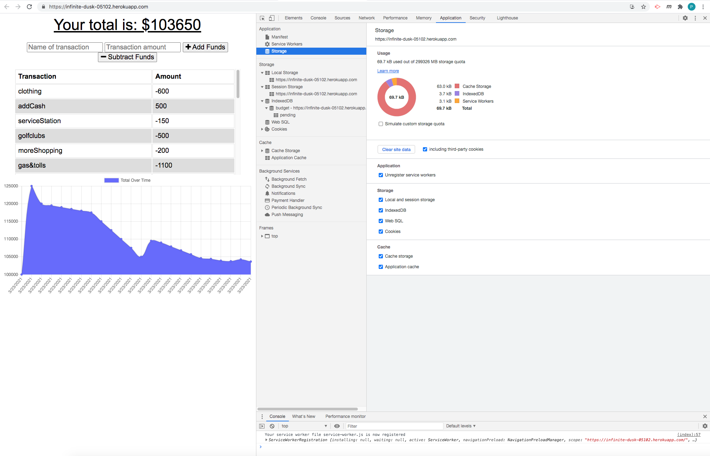
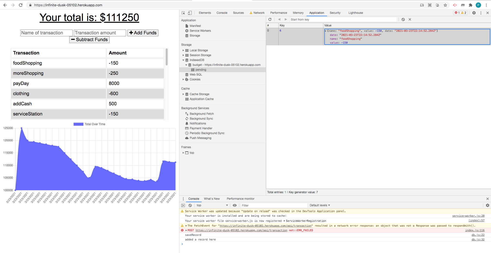
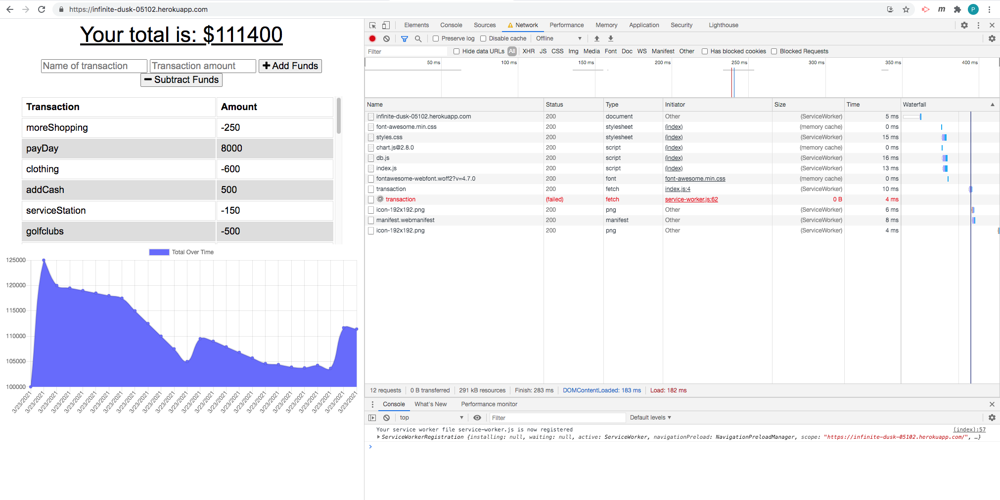

# Project Title: HW 18 Budget Tracker
    
  ## Table of Contents:
  - [Project Description](#project-description)
  - [Installation Instructions](#installation-instructions)
  - [Project Usage Information](#project-usage-information)
  - [Contribution Guidelines](#contribution-guidelines)
  - [License Type](#license-type)
  - [Github Repo Link](#github-repo-link)
  - [HEROKU Live APP Link](https://blooming-taiga-93429.herokuapp.com/?id=60512ad42d8d850015644c81)
  - [Github Information](#github-information)
  - [my-email-for-questions-and-information](#my-email-for-questions-and-information)

  - - -
  ## Screenshot of the App running as on Heroku:
  
  ===
  ## Select Exercise Type:
  
  ===
  ## Select a Cardio Workout & enter your metrics:
  
  ===
  ## Completing the Cardio Workout, results shown
  
  ===
  ## Workout Dashboard
  
  ===
  ## Adding a Resistance Workout :
  
  ===
  ## Enter Resistance Workout Metrics:
  
  ===
  ## Completing the Resistance Workout
  
  ===
  ## Workout Dashboard
  

  &nbsp;
  - - -
  ## Project Description:
  - This is an PWA, progressive web application that allows you to add and track your funds, as a budget calculator.  You can add an subtract money amounts and identify the transaction with that credit or debit (add,subtract funds).  A rendered graph of your expences will update each time you make a transaction.  The application will also work offline and when reconnected to a network will update accordinly.  See example screenshots.

  &nbsp;
  - - -
  ## Installation Instructions:
  - The user only has to follow the Heroku Deployed Application link https://infinite-dusk-05102.herokuapp.com/  or can run the application locally from the terminal by first running >npm i to get all dependencies and then to begin the app, type:  >node server.js  and the burger app will open in the browser.

  &nbsp;
  - - -
  ## Project Usage Information:
  - To be able to create and track a daily budget, either online or offline.

  &nbsp;
  - - -
  ## Contribution Guidelines:
  - I made this, PAC with Streaming Turtles, LLC

  &nbsp;
  - - -
  ## License Type:
  - 

  &nbsp;
  - - -
  ## gitHub Repo Link:
  - https://github.com/streamingTurtles/18-Budget-Tracker

  &nbsp;
  - - -
  ## HEROKU Live Application URL:
  - https://infinite-dusk-05102.herokuapp.com/

  &nbsp;
  - - -
  ## Github Information:

  
- user name: streamingTurtles
- [GitHub Profile](https://github.com/streamingTurtles)

  ## my-email-for-questions-and-information:
  - pcardillo@streamingTurtles.com  

  &nbsp;
- - -
- - -
Peter Cardillo, Columbia Engineering Fullstack Bootcamp, 2020-2021  
